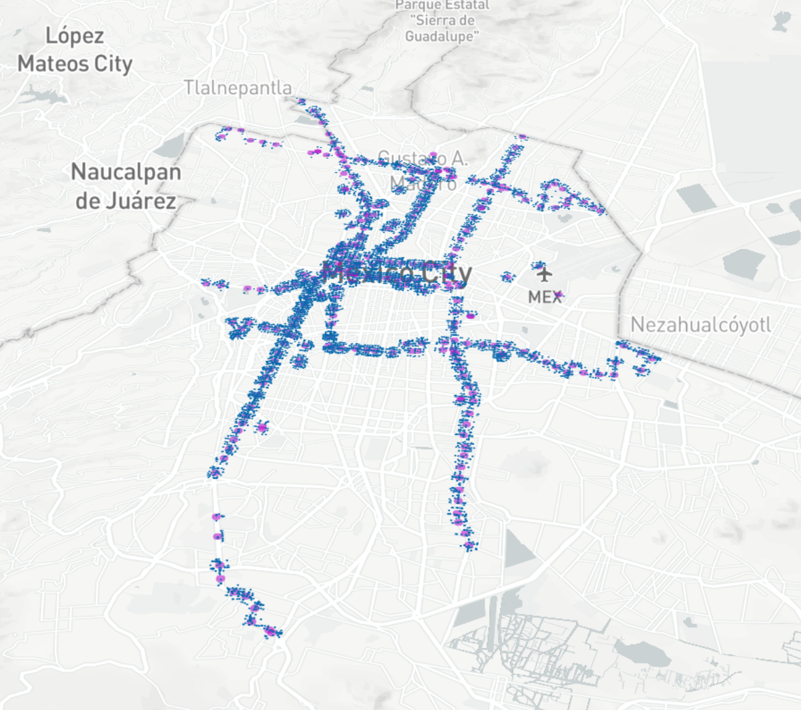
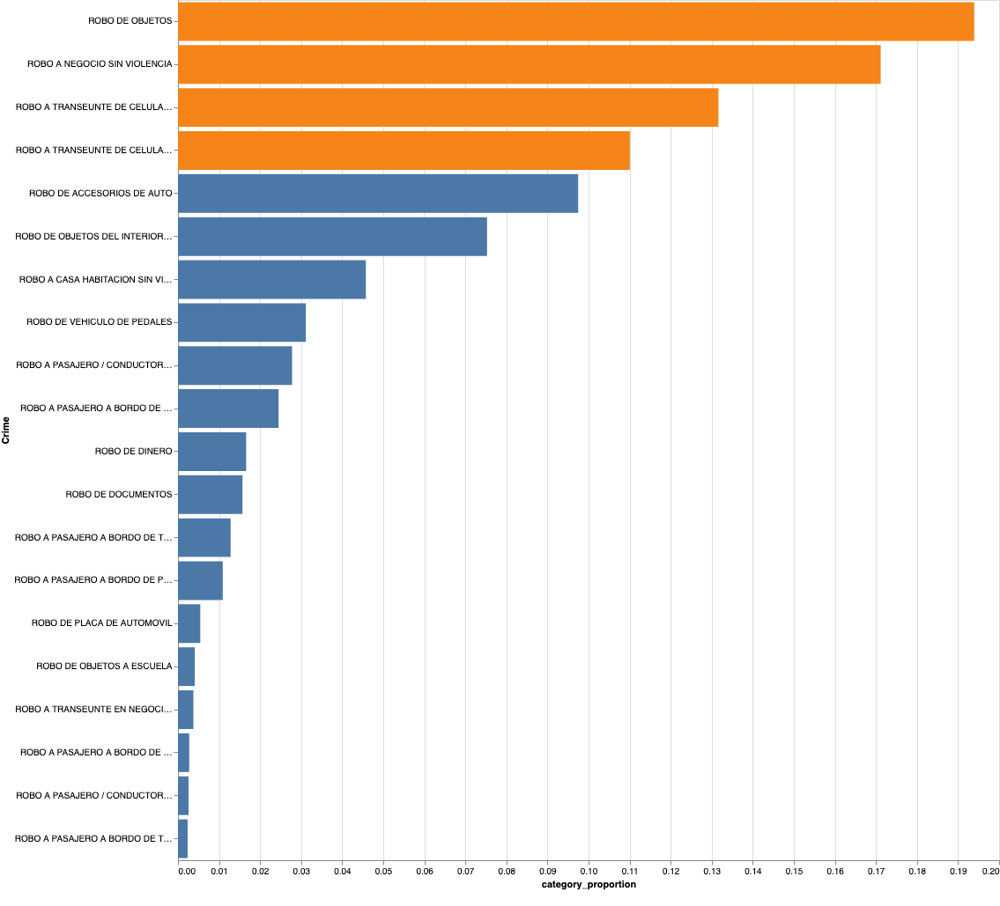
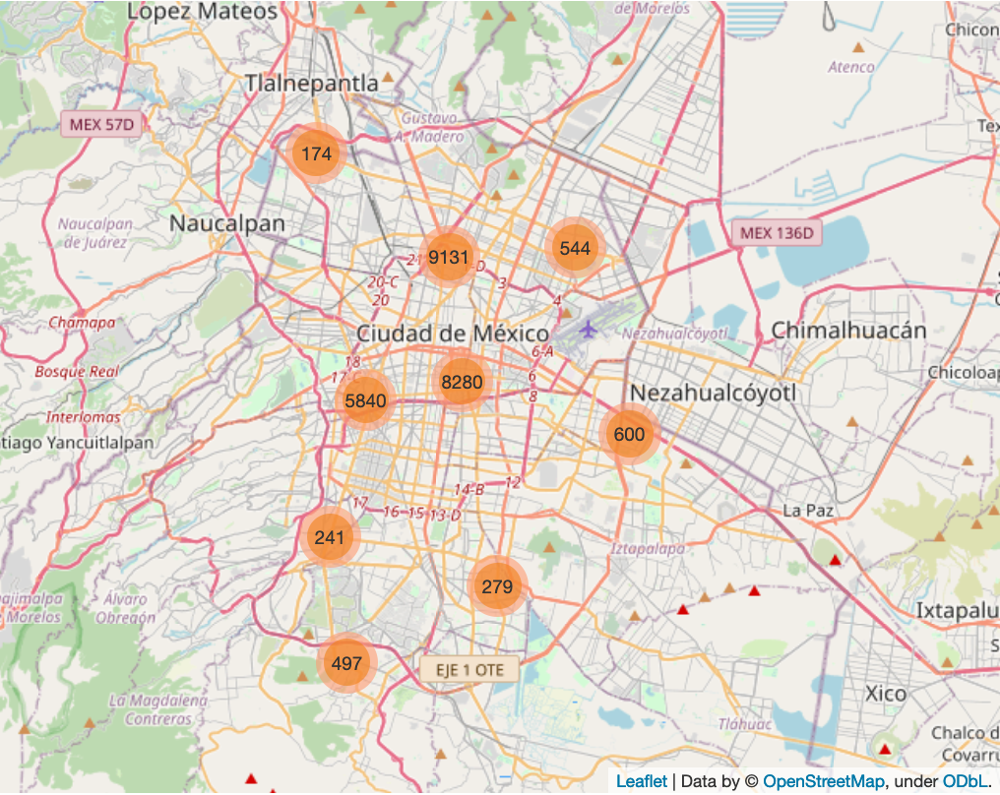
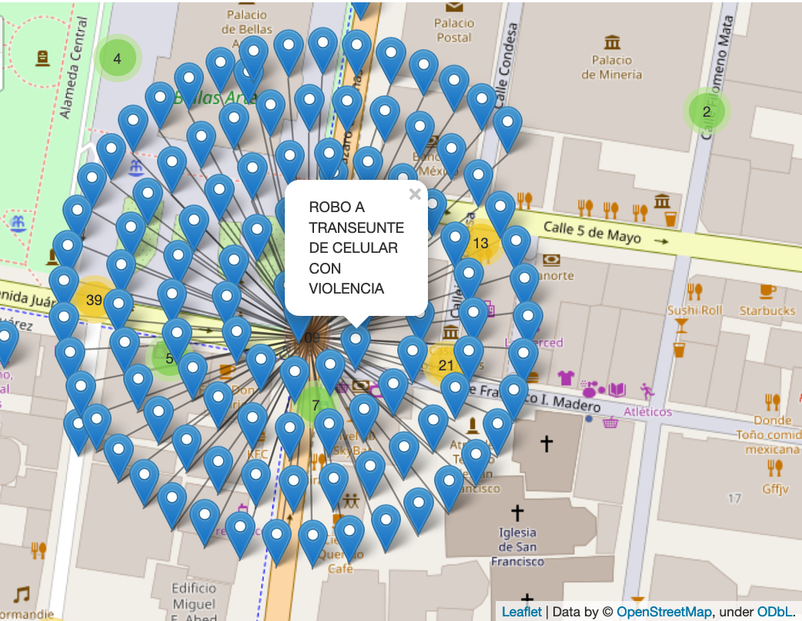
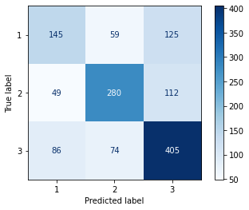
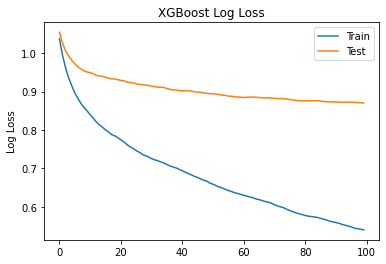
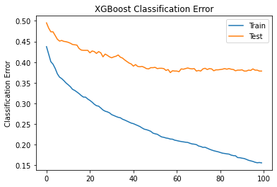

# Capstone Project
## Mexico City robberies multi-class classification

### 1. Problem statement
 Mexico city is considered to be in the top 10 largest cities in the word. As pointed out by statista, "the metrobus system of the Mexican capital transported nearly 404 million passengers in the first quarter of 2019, up from 398.5 million passengers in the same period of the previous year." The large number of affluence in all the public transport services creates an opportunity for the rate of crimes to grow, and at the same time it makes it difficult for authorities to narrow down which types of crimes are more likely to happen. 

This projects presents a model that is inteded to perform better than a baseline model createdy with sklearn `dummyClassifer`. An `XGBoost` multiclass classifier will predict the categorization of a new possible robbery based on the affluence, distance from the metrobus stations and other geographical attributes of the crime. In addition, this model seeks to perform well on the weighted average. 

### 2. Data Collection
The purpose of this project is to explore the Mexico city database wich contains numerous datasets of the different insitutions of the local govermennt. In this case I decided to focus on the the folders of investigation of crimes at street level of the Attorney General's Office of Mexico City from January 2016 to June 2019 [(source)](https://datos.cdmx.gob.mx/explore/dataset/carpetas-de-investigacion-pgj-cdmx/information/). In addition, the model presented takes into consideration the dataset of daily influx by metrobus.

### 3. EDA 

For this particular project all the crimes that occurred in a distance (km) range of [0,.3] form the nearest metrobus station were considered to be significant for modeling porpuses. The following plot presents all the  crimes considered to be close enough to a metrobus station be included in futher stages of the project. 

The crimes categories that were considered in the model can be seen in orange in the barchart. These categories represent almost 70 percent of all the observations in the dataset, also they tend to be the crimes that daily users of the metrobus tend to be worried about during their commutes.

### 4. Feature Engineering
#### Feature Engineering: `nearest_mb`

As mentioned in the exploratory data analysis of the project, due to the fact that the a large proportion of the crimes are close geographically it makes it harder to find potential ways to differentiate the observations. A simple K-NN model was used for creating the first engineered feature for determining the closest MB station depending the location of the crime. This feature is present in the `master_df.csv` feature as `nearest_mb`.

#### Feature Engineering: `dist_km` and `manhattan_dist`

The master dataset that was created by combining different datasets from the Mexico City's open databases allows us to have the geolocations of the crime and the nearest metrobus. These features are used for creating engineering features that represent the distance between both points. 

The following medium post was used as reference for creating the functions methods [(source)](https://maney020.medium.com/feature-engineering-all-i-learned-about-geo-spatial-features-649871d16796).  

#### Feature Engineering: `bearing`

Still using the geolocation of both the crime and the corresponding closest metrobus station the bearing can be calculated. In this way we can have a metric that describes direction.  

#### Feature Engineering: `geo_hash_crime` and `geo_hash_mb`

Trying to explore different ways to enclose several observations without adding uncessary complexity to the feature engineeirng process the geocdoe system known as Geohash was used to created two new engineered features. As explained by [wikipedia](https://en.wikipedia.org/wiki/Geohash) Geohash "is a hierarchical spatial data structure which subdivides space into buckets of grid shape". In this way new categorical features can be used for further examining close observations and improving the model performance. 

### 5. Project Challenges and Limitations
One of the main challanges for this project was to explore several ways to try to create new features that could help in classifitying observations that tend to be geographically close from each other. The following map presents the clusters of the subset of crimes that were considered to be significant. Doing further analysis on any of the highly dense clusters it is clear that by just using coordinates without any feature engieenering it can make it hard for a model to correclty classify the crimes of new test set. 

As seen in the jointplot there are high density areas where most of the economic and social activity happens in Mexico City. People usually commute to the high density areas from others parts of the city. This also creates another layer of difficulty due to the fact that by nature most of the observations are going to be concentrated in certain points.

### 6. Model implementation and performance

As discussed previoulsy, due to some of the challenges that the dataset presents in terms of having a lot of their observations happening close from each other the performance of the model wasn't overwhelmenly good, but it presents a base of a possible route to imporove the classification of these crimes. 

- Encoded crimes classes_target = {3 : 'THEFT OF OBJECTS', 2 : 'CELL PHONE THEFT WITHOUT VIOLENCE', 1 : 'CELL PHONE THEFT WITH VIOLENCE'}

The model is capable of reaching on the train set mean accuracy of .81, and in the test set a weighted f1-score of .62 and mean accuracy of .61 wich is better than the baseline Classifier (using a most frequent strategy) which has a mean accuracy of .41. Some of the aspects worth highlighting from the XGBoost classification model, is that it is capable of classifiying with type 3 crimes with are theft of objects with recall score of .71 on the test set.

### 5. Conclusion + Recommendations

This project was intended for exploring an alternative for multi-class classification using XGBoost. Due to the similiarity of characteristics that extist between the observations finding a high performing model is a difficult task. Although this model was able to perform better than a dummy classifier a RNN should be the next step in terms of trying to improve the model presented.

